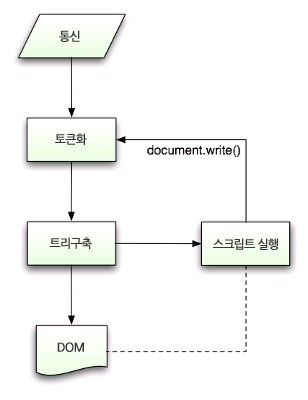
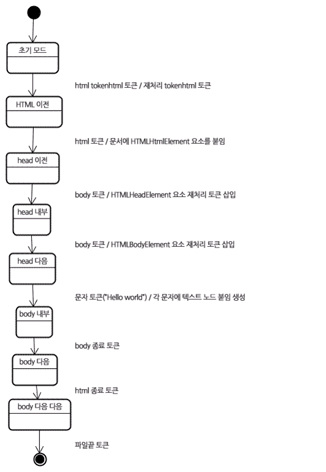

# 프론트엔드 CS #1 브라우저

#### I - 1. 브라우저의 주요 기능

---

- 브라우저의 주요 기능 = 사용자가 선택한 자원을 서버에 요청하고 브라우저에 표시하는 것
- 브라우저는 HTML과 CSS에 따라 HTML 파일을 해석해서 표시

#### I - 2. 브라우저의 기본 구조

---

- 사용자 인터페이스 - 주소 표시줄, 이전/ 다음 버튼 등 요청한 페이지를 보여주는 창을 제외한 나머지 모든 부분
- 브라우저 엔진 - 사용자 인터페이스와 렌더링 엔진 사이의 동작을 제어
- 렌더링 엔진 - 요청한 콘텐츠를 표시
- 통신 - HTTP 요청과 같은 네트워크 호출에 사용
- UI 백엔드 - 콤보 박스와 창 같은 기본적인 장치를 그림
- 자바스크립트 해석기 - 자바스크립트 코드를 해석하고 실행
- 자료저장소 - 자료를 저장하는 계층. 쿠키를 저장하는 것과 같이 모든 종류의 자원을 하드 디스크에 저장할 필요가 있다.

#### I - 3. 렌더링 엔진과 동작과정

---

- 크롬과 사파리는 Webkit 엔진을, 파이어폭스는 Gecko 엔진을 사용
- 동작과정

1.  DOM 트리구축을 위한 HTML 파싱
2. 렌더 트리 구축
3. 렌더 트리 배치
4. 렌더 트리 그리기

#### I - 4. 파싱

- 문서 파싱은 브라우저가 코드를 이해하고 사용할 수 있는 구조로 변환하는 것
- 파싱 결과는 보통 문서 구조를 나타내는 노드 트리인데 이를 파싱 트리 혹은 문법 트리라고 한다

- 파싱은 문서에 작성된 언어 또는 형식의 규칙을 따른다. 이를 문맥 자유 문법이라고 한다

##### 파서-어휘 분석기 조합

- 파싱은 어휘 분석과 구문 분석이라는 두 가지로 구분할 수 있다
- 어휘 분석 = 자료를 토큰으로 분해하는 과정 
- 토큰은 유효하게 구성된 단위의 집합체로 예를 들자면 사전에 등장하는 모든 단어와 같다
- 파서는 자료를 유효한 토큰으로 분해하는 어휘분석기가 있고 언어 구문 규칙에 따라 문서 구조를 분석함으로써 파싱 트리를 생성하는 파서가 있다. 
- 어휘 분석기는 공백과 줄 바꿈같은 의미없는 문자를 제거한다.

- 파싱을 반복하면서 어휘 분석기로부터 새 토큰을 받아서 구문 규칙과 일치하는지 확인하고 맞으면 토큰에 해당하는 노드를 파싱트리에 추가
- 맞지 않으면 파서는 토큰을 내부적으로 저장하고 토큰과 일치하는 규칙이 발견될 때 까지 요청한다. 맞는 규칙이 없는 경우 예외로 처리한다.

##### 변환

소스 코드를 기계 코드로 만드는 컴파일러는 파싱 트리 생성 후 이를 다시 기계 코드 문서로 변환한다

##### 파서의 종류

파서는 하향식 파서와 상향식 파서로 나뉜다.

- 하향식 파서

  - 구문의 상위 구조로부터 일치하는 부분을 찾는다

  - ex) 

    2+3-1을 파싱할 때

    1. 하향식 파서는 2+3과 같은 표현식에 해당하는 높은 수준의 규칙을 먼저 찾는다.
    2. 그 다음 표현식으로 2+3-1을 찾는다. 
    3. 표현식을 찾는 과정은 일치하는 다른 규칙을 점진적으로 더 찾아내는 방식인데 가장 높은 수준의 규칙을 먼저 찾는다

- 상향식 파서

  - 구문의 낮은 수준에서 점차 높은 수준으로 찾는다
  - ex)
    1. 입력 값이 규칙에 맞을 때까지 찾아서 맞는 입력 값을 규칙으로 바꾼다. 이 과정을 입력 값의 끝까지 진행된다
    2. 상향식 파서는 입력 값의 오른쪽으로 이동하면서 구문 규칙으로 갈수록 남는 것이 점차 감소하기 때문에 이동-감소 파서라고 부른다.

  

  ##### HTML 파서

  HTML 파서는 HTML 마크업을 파싱 트리로 변환한다.

  전통적인 파서는 HTML에 적용할 수 없다. HTML은 파서가 요구하는 문맥 자유 문법에 의해 쉽게 정의할 수 없기 때문이다!!!

  

  - 파싱은 대신 CSS와 자바스크립트를 파싱하는데 사용된다

  

  HTML 정의를 위한 공식적인 형식으로 DTD가 있지만 문맥 자유 문법이 아니다.

  

  ##### DOM

  DOM은 문서 객체 모델(Document Object Model)이다. 파싱트리는 DOM 요소와 속성 노드의 트리로서 출력 트리가 된다.

  

  DOM은 HTML 문서의 객체 표현이고 외부를 향하는 자바스크립트와 같은 HTML 요소의 연걸 지점이다. 트리의 최상위 객체는 문서이다.

  

  ###### !! DOM은 마크업과 1:1의 관계를 맺는다.

##### HTML의 파싱 알고리즘

- HTML은 일반적인 하향식이나 상향식 파서로 파싱이 불가하다!

- HTML의 파싱 알고리즘은 토큰화와 트리 구축의 2단계!
- 

##### 토큰화 알고리즘

결과물로 HTML 토큰을 생성한다.

알고리즘은 상태 기계(state machine)이라고 볼 수 있다!

각 상태는 하나 이상의 연속된 문자를 입력받아 문자에 따라 다음 상태를 갱신한다.

- ###### 결과는 현재의 토큰화 상태와 트리 구축 상태의 영향을 받는다!!!

- ###### 같은 문자여도 현재 상태에 따라 다음 상태의 결과가 다르게 나오는 것!!

1. 초기 상태는 자료 상태이다. < 문자를 만나면 태그 열림 상태로 변한다.
2. a부터 z까지의 문자를 만나면 시작 태그 토큰을 생성하고 상태는 태그 이름 상태로 변한다.
3. `>` 문자를 만나면 현재 토큰이 발행되고 상태가 다시 자료 상태로 바뀐다.

##### 트리 구축 알고리즘

파서가 생성되면 문서 객체가 생성된다. 트리 구축이 진행되는 동안 문서 최상단에는 DOM 트리가 수정되고 요소가 추가된다. 토큰화에 의해서 발행된 각 노드가 트리 생성자에 의해 처리된다. DOM 트리에 요소를 추가하는 것이 아니라면 열린요소는 스택(임시 버퍼 저장소)에 추가된다. 이 스택은 부정확한 중첩과 종료되지 않은 태그를 교정한다.

트리구축 단계의 입력값은 토큰화 단계에서 만들어지는 토큰이다.

